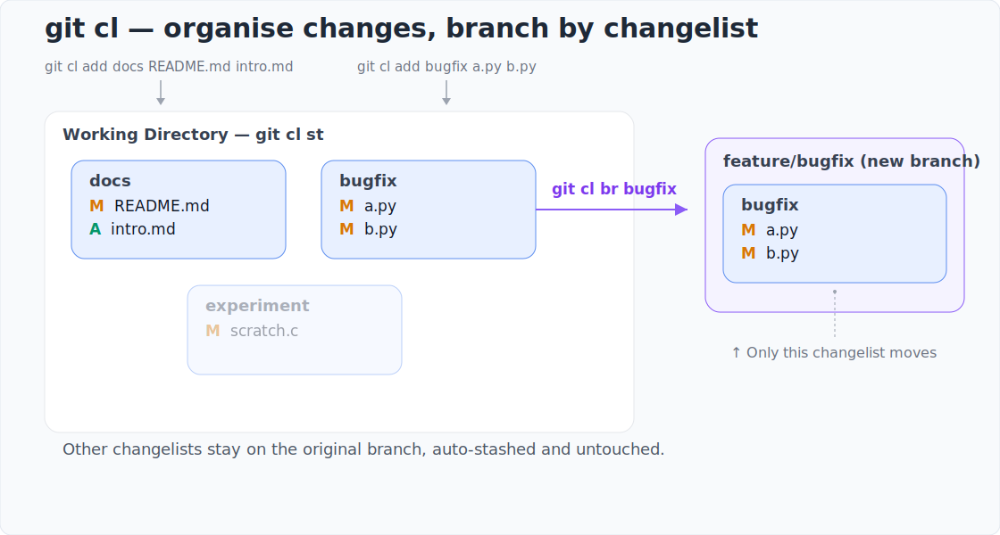

<!--
git-cl is a minimal Git subcommand that brings changelist support to Git. Organise modified files into named changelists before staging or committing. Ideal for managing partial commits.
-->
# git-cl

> A Git subcommand for managing named changelists — organise files by purpose before staging.

[](https://github.com/BHFock/git-cl/blob/main/docs/tutorial.md)

`git-cl` is a command-line tool that offers Git changelist support, inspired by Subversion. It allows users to assign working directory files to named changelists, helping organise work by intent, manage partial commits, and create branches directly from a changelist.

Perfect for developers who prefer to organise their work logically from the start, rather than managing complex commit history afterwards.

## Why git-cl?

- Group files logically before staging using Git changelists
- Work on multiple features on a single branch
- Stage and commit changes by intent
- Stash changelists and resume work later
- Create a new branch directly from a changelist
- Local-only metadata (`.git/cl.json`)
- Simple CLI: `git cl <command>`

## Branching from changelists

<a href="docs/tutorial.md#42-branching-mid-feature-with-git-cl-branch">
  
</a>

## Quick Start
```
# Install
mkdir -p ~/bin
wget https://raw.githubusercontent.com/BHFock/git-cl/main/git-cl -O ~/bin/git-cl
chmod +x ~/bin/git-cl

# Verify Installation
git cl --version
git cl help

# Use changelists inside a Git repository
git cl add fixup file1.py
git cl status
git cl commit fixup -m "Fix file1"
```

Make sure `~/bin` is listed in your `$PATH`. 

## Common Commands
```bash
# Add files to a changelist
git cl add docs-fix README.md docs/index.md

# See changes grouped by changelist
git cl status

# Stage or commit changelists
git cl stage docs-fix
git cl commit docs-fix -m "Update documentation layout and intro"

# Keep the changelist after committing
git cl commit docs-fix -m "Fix bug" --keep

# Remove a file from its changelist
git cl remove README.md

# Delete a changelist
git cl delete docs-fix

# Temporarily stash a changelist and resume work on a new branch
git cl stash docs-fix
git checkout -b docs-fix-work
git cl unstash docs-fix

# Create and switch to a new branch from a changelist (auto-stash/unstash)
git cl br docs-fix
```

## Documentation

📘 [Full Tutorial](docs/tutorial.md): Guide with examples and FAQ

📘 [Design Notes](docs/design-notes.md): Technical architecture

📘 [Why git-cl?](docs/why-git-cl.md): History and motivation

## Notes

- Requires Python 3.9+, Git, and a Unix-like OS
- Local-only; designed for single-user workflows
- Always inspect downloaded scripts before executing — see [source](https://github.com/BHFock/git-cl/blob/main/git-cl)
- For security concerns, see [SECURITY](./SECURITY.md)

## License

BSD 3-Clause — see [LICENSE](./LICENSE) | [CONTRIBUTING](CONTRIBUTING.md)

<!--
Keywords: git changelist, svn changelist, partial commit, group files, perforce, git extension, organise changes, subversion, named staging area, pre-staging, commit logical units, selective commit
-->
