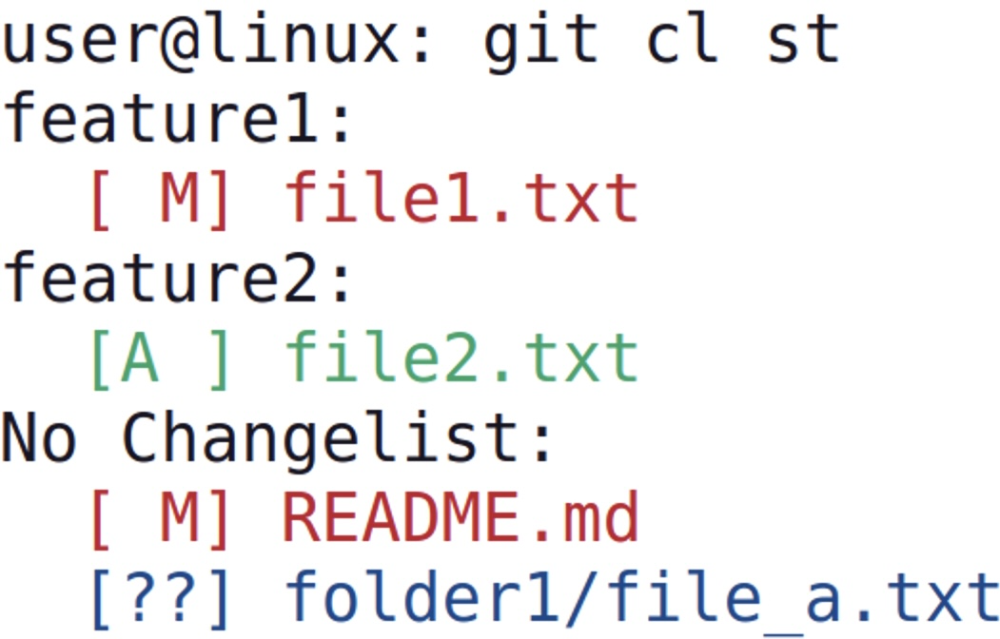

# git-cl

> A Git subcommand for managing named changelists — group files into changelists before staging.

[](https://github.com/BHFock/git-cl/blob/main/docs/tutorial.md)

`git-cl` is a command-line tool for Git that introduces Subversion-style changelists. It allows users to assign working directory files to named changelists, helping organise work by intent and manage partial commits more easily.

## Features

- Create and manage named changelists to group related file changes
- View changes grouped by changelist in a `git status`-like view
- Stage and commit changelist contents selectively, by name
- Read commit messages from files using `-F` (like `git commit`)
- Simple JSON-based local tracking (no changes to Git internals)
- Seamless integration via `git cl` subcommand interface

## How It Works

Changelists are stored in a simple `cl.json` file inside your repository’s `.git` directory. This keeps all metadata local and avoids polluting your working directory or history.

## Requirements

- Python 3.9+
- Git installed and available in your `$PATH`
- Unix-like OS (Linux, macOS)

## Installation

To use `git cl` as a Git subcommand, place the executable script named `git-cl` in a directory that’s part of your system’s `$PATH`, such as `~/bin`. For example:

```
chmod +x git-cl
mkdir -p ~/bin
mv git-cl ~/bin/
```

Make sure `~/bin` is listed in your `$PATH`. You’ll then be able to run:

```
git cl --version
git cl help
```

Git will recognise `git-cl` as the handler for `git cl`, just like its built-in commands.

## Quick Reference

Below are common `git cl` commands for typical changelist workflows:

```bash
# Create a changelist implicitly by adding files to it
git cl add docs-fix README.md docs/index.md

# View modified files grouped by changelist
git cl status

# Stage all files in a changelist and delete it
git cl stage docs-fix

# Keep the changelist after staging
git cl stage docs-fix --keep

# Commit all changes in a changelist
git cl commit docs-fix -m "Update documentation layout and intro"

# Commit with message from file
git cl commit docs-fix -F commit-message.txt

# Keep the changelist after committing
git cl commit docs-fix -m "Fix bug" --keep

# Remove a file from its changelist
git cl remove README.md

# Delete a changelist manually (even if it still contains files)
git cl delete docs-fix
```

See the [git-cl Tutorial](docs/tutorial.md) for detailed usage, examples, and tips.

## Visual Example

Sample Output of `git cl`:

<p align="left">
  
</p>

## Maintenance Disclaimer

This is a personal tool, built to support my own Git workflow. It’s shared as-is for reference. No active maintenance or collaboration is planned — but forks are welcome.


## License

BSD 3-Clause License — see [LICENSE](./LICENSE) for details.

<!--
#git-changelists #git-workflow-tools #svn-style-git #git-cli #partial-commits #git-subcommand
-->

