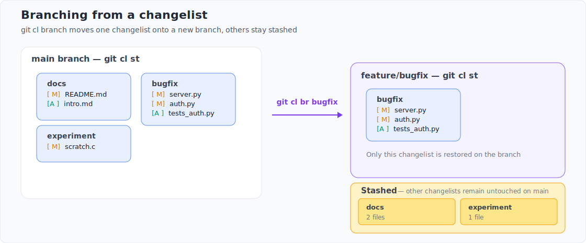
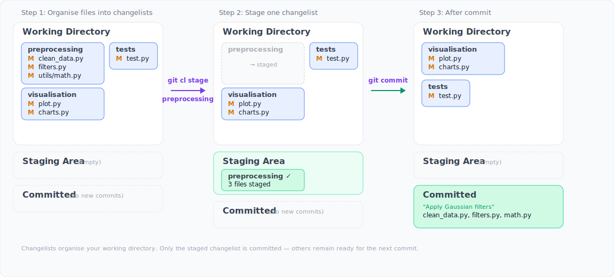

# git-cl: A Pre-Staging Layer for Organising Changes in Git

Björn Hendrik Fock

*February 2026*

## Abstract

git-cl is a command-line tool that brings changelist support to Git. It introduces a pre-staging layer — a persistent, metadata-driven abstraction between the working directory and Git's staging area — that allows developers to partition modified files into named groups before staging or committing. Changelists persist across sessions, support selective stashing, and can be promoted to dedicated branches. The tool stores its state in a local JSON file within the `.git` directory, requires no external dependencies beyond Python and Git, and integrates transparently with existing Git workflows. This paper presents the conceptual model of pre-staging in distributed version control, describes the design and implementation of git-cl, and discusses how file-level changelist organisation complements Git's existing mechanisms.

**Availability:** git-cl is freely available at [https://github.com/BHFock/git-cl](https://github.com/BHFock/git-cl) under the BSD-3-Clause licence.

## 1. Introduction

A developer's workflow is seldom linear. Practitioners frequently work on multiple concerns simultaneously — a feature, a bug fix, a refactoring — within the same working directory. Git provides the staging area to prepare commits, but it is fundamentally a single, unnamed preparation state. There is no native mechanism to persistently organise multiple concurrent changes into named groups before they enter the commit history.

This gap is not new. Subversion's changelists allowed developers to associate modified files with named groups, functioning as lightweight organisational labels — sticky notes for changed files — that persisted until commit. Developers migrating from Subversion or Perforce to Git gained powerful branching and merging but lost this grouping mechanism. No native Git feature offers a persistent, named organisational layer during active development.

This paper presents git-cl, a command-line tool that introduces a pre-staging layer to Git. By allowing developers to partition their working directory into named changelists that persist across sessions, git-cl supports organising work by intent before staging or committing. Changelists can be selectively stashed, and promoted to dedicated Git branches. The tool operates entirely through local metadata stored in `.git/cl.json`, requires no external dependencies beyond Python and Git, and integrates transparently with existing workflows.

The remainder of the paper is organised as follows. Section 2 reviews related approaches to managing concurrent changes in version control. Section 3 describes the design and implementation of git-cl. Section 4 illustrates key workflows and use cases. Section 5 discusses design trade-offs, availability, and future directions.

## 2. Related Work

The challenge of managing concurrent changes has been addressed at different stages of the version control workflow. This section reviews existing approaches — from changelist models in centralised systems, through Git's native mechanisms and post-commit cleanup tools, to IDE-based implementations — and situates git-cl among them.

### 2.1 Changelist Models in Other Version Control Systems

Subversion introduced changelists as a client-side feature that allows developers to associate modified files with named groups [1][2]. These groups act as local organisational filters that persist until commit, enabling developers to work on multiple logical tasks and commit them separately. Subversion changelists served as the primary model for git-cl, particularly the ability to provide structured pre-commit review by grouping files by intent. However, Subversion's implementation is tied to a centralised architecture. When teams migrated to Git, they gained distributed branching and merging but lost this lightweight grouping mechanism.

Perforce provides a more formal changelist model through numbered, server-managed pending changelists that track file groups throughout the development lifecycle [3]. While more powerful than Subversion's client-side approach, Perforce changelists are tightly integrated with its centralised server architecture and not transferable to Git's distributed model.

### 2.2 Native Git Mechanisms

Git offers several mechanisms that partially address the organisation of concurrent changes, though none provides persistent named grouping.

The *staging area* (index) allows selective preparation of commits, but supports only a single, unnamed state at a time. Once a commit is made, the organisational context is lost.

*git stash* [4] temporarily shelves uncommitted changes, but operates as an unnamed stack. Stashing requires removing code from the working directory, disrupting the developer's working context. Retrieving a specific stash from a deep stack is cognitively taxing, and stashes carry no semantic label beyond an auto-generated message.

*git add --patch* [5] enables hunk-level staging, allowing developers to select individual changes within a file for the next commit. This is a powerful mechanism for producing atomic commits, but it operates retrospectively — the developer must reconstruct intent at commit time rather than recording it during development.

*git worktree* [6] allows multiple working directories linked to the same repository, each with its own checked-out branch. This enables genuinely parallel work, but at the cost of maintaining separate directory trees. For small, interleaved changes — a quick fix alongside a feature — a full worktree is often disproportionately heavyweight.

*Branches* are Git's primary model for isolating parallel work. However, branching requires either committing or stashing current changes before switching context. For exploratory or early-stage work where the scope is not yet clear, the overhead of creating and managing branches can discourage their use.

### 2.3 Post-Commit Cleanup

Rather than organising changes before committing, an alternative strategy is to commit freely and restructure history afterwards. *git rebase -i* [7] allows developers to reorder, squash, split, and edit commits after the fact. Combined with *git commit --amend* and *git autosquash* [8], this enables powerful retrospective cleanup.

However, these tools place the organisational burden at the end of the workflow rather than distributing it throughout development. Rewriting history on shared branches carries risks, and interactive rebasing of complex histories demands careful attention. Post-commit cleanup and pre-staging organisation address different points in the workflow and can be used together.

### 2.4 GUI and IDE Implementations

The utility of changelists has been recognised by several integrated development environments. The JetBrains suite (IntelliJ IDEA, PyCharm) provides a "Changelists" feature that allows logical grouping of modified files within the IDE [9]. Various VS Code extensions attempt similar functionality.

However, these implementations are accessible only through their respective graphical interfaces. A developer who organises files into changelists within an IDE cannot access or manipulate those groupings from the command line. For workflows that rely on terminal-based Git usage — or that alternate between editors — this creates a fragmentation where changelist state depends on which tool is currently open.

git-cl addresses this by providing a CLI-native implementation whose metadata, stored in `.git/cl.json`, is accessible to any tool that can read a JSON file. This opens the possibility for IDE plugins to adopt the same metadata format, enabling a seamless experience across terminal and graphical interfaces.

### 2.5 Positioning of git-cl

git-cl occupies a distinct position among these approaches. It provides the named, persistent grouping of Subversion's changelists, adapted for Git's distributed model. Unlike native Git mechanisms, it maintains organisational context across sessions without requiring branches, stashes, or separate working directories. Unlike IDE changelists, its metadata is terminal-native and stored within the `.git` directory, accessible regardless of editor or interface.

Table 1 summarises the key differences.

*Table 1: Comparison of approaches to managing concurrent changes*

| Approach | Persistent groups | Named groups | Selective stash | Branch promotion | Interface | Editor-independent |
|---|---|---|---|---|---|---|
| SVN changelists | Yes | Yes | No | No | CLI | Yes |
| Perforce changelists | Yes | Yes (numbered) | No | No | CLI/GUI | Yes |
| git stash | No | No | No | No | CLI | Yes |
| git add --patch | No | No | No | No | CLI | Yes |
| git worktree | N/A | N/A | N/A | N/A | CLI | Yes |
| git rebase -i | N/A | N/A | N/A | N/A | CLI | Yes |
| JetBrains changelists | Yes | Yes | No | No | GUI | No |
| **git-cl** | **Yes** | **Yes** | **Yes** | **Yes** | **CLI** | **Yes** |

## 3. Design and Implementation

git-cl employs a sidecar metadata pattern. Rather than modifying Git's index or object database, the tool maintains state in human-readable JSON files within the `.git` directory, ensuring non-destructive and portable operation.

### 3.1 Metadata Architecture

git-cl uses two metadata stores to separate active work from preserved work-in-progress:

`cl.json` maps named changelists to lists of file paths relative to the repository root. This is the pre-staging layer where files are grouped before any Git operation. A typical `cl.json` might contain:

```json
{
  "feature-logic": ["src/core.py", "tests/test_core.py"],
  "playground": ["notes/tmp.txt"]
}
```

`cl-stashes.json` stores metadata for stashed changelists, including the source branch, file categories, and a reference to the corresponding entry in Git's native stash stack. When a changelist is stashed, its entry moves from `cl.json` to `cl-stashes.json`; the actual file contents are held by Git's own stash mechanism. This separation ensures that git-cl's stash operations remain coordinated with Git's internal state rather than duplicating it.

Both files are stored inside `.git/` and are not version-controlled. All paths are stored relative to the repository root for portability — the repository can be moved without invalidating changelist metadata.

### 3.2 Design Principles

Three principles guided the implementation:

*Wrap, don't reimplement.* git-cl delegates all version control operations to native Git commands. Status detection uses `git status --porcelain`, stashing uses `git stash push`, and branch creation uses `git checkout -b`. This keeps the tool lightweight and ensures it benefits from Git's own correctness and performance.

*Single file, zero dependencies.* The entire implementation is a single Python script (approximately 3,250 lines) with no external dependencies beyond Python 3.9+ and Git. This allows installation by downloading one file, making it suitable for restricted or air-gapped environments.

*Non-destructive operation.* git-cl never alters Git's index, object database, or commit history. All changelist state is confined to the two JSON metadata files. If the metadata files are deleted, the repository is unaffected — only the changelist groupings are lost.

### 3.3 The Branch Workflow

The most architecturally involved feature is promoting a changelist to a dedicated Git branch via `git cl branch`. This automates a sequence that would otherwise require careful manual coordination:

1. All active changelists are stashed, creating a clean working directory.
2. A new branch is created and checked out.
3. Only the target changelist is restored on the new branch. Other changelists remain stashed and can be restored later.

Figure 1 illustrates this workflow. If any step fails, git-cl attempts to restore all stashed changelists to their prior state, preventing partial corruption of the working directory.

<p align="center">
  
</p>

*Figure 1: The git-cl branch workflow — stash all changelists, create a new branch, and selectively restore the target changelist.*

This workflow supports late-binding branching: developers are not forced to decide on branch structure before work begins. They can code freely, organise incrementally into changelists, and promote work to a formal branch once its scope becomes clear.

## 4. Workflows and Use Cases

This section illustrates the two primary workflows enabled by git-cl: organising changes for review before staging, and promoting changelists to dedicated branches.

### 4.1 Pre-Staging Review

In a standard Git workflow, `git status` presents a flat list of modified files. In active development across multiple concerns, this list can grow to dozens of files with no indication of which changes belong to which task. The developer must reconstruct this mapping mentally at commit time.

git-cl addresses this by allowing developers to assign files to named changelists as they work. Consider a developer making changes across preprocessing logic, visualisation code, and tests. Using git-cl, they organise their working directory:

```
git cl add preprocessing clean_data.py filters.py math.py
git cl add visualisation plot.py charts.py
git cl add tests test.py
```

Running `git cl status` now shows changes grouped by intent rather than as a flat list. The developer can review each group, verify that no files are misplaced, and then stage and commit one changelist at a time:

```
git cl stage preprocessing
git commit -m "Refactor data preprocessing pipeline"
```

The remaining changelists stay intact for subsequent commits. Figure 2 illustrates this workflow.

<p align="center">
  
</p>

*Figure 2: The pre-staging review workflow — organise files into changelists, stage one changelist, commit, and continue with the remaining changelists.*

This amounts to a self-review step embedded in the working directory. Rather than reconstructing intent at commit time, the developer records it during development and verifies it before staging.

### 4.2 Late-Binding Branching

In Git, the decision to create a branch is typically made before work begins. However, developers often start small changes that grow organically into larger features. By the time a dedicated branch seems warranted, uncommitted changes are already spread across the working directory.

With `git cl branch`, a developer can promote a changelist to its own branch at any point. A changelist that began as a small optimisation:

```
git cl add solver-opt src/solver.f90 src/utils_math.f90
```

can later be moved to a dedicated branch:

```
git cl branch solver-opt
```

As described in Section 3.3, this command stashes all active changelists, creates the new branch, and restores only the target changelist. The developer continues working on a clean branch with the changelist intact, while other changelists remain stashed and available for later restoration.

This workflow removes the need to predict scope upfront. Developers can organise incrementally and defer the branching decision until complexity warrants it.

## 5. Discussion and Conclusion

**File-level abstraction.** git-cl operates at file level rather than hunk level. This reflects how developers typically think during active coding — grouping files by task rather than selecting individual hunks. For finer-grained staging within a file, Git's `git add -p` remains available and complementary.

**Limitations.** git-cl targets single-user, Unix-based workflows. File locking relies on `fcntl`, which is not available on Windows. The tool does not validate changelist contents against branch state — a changelist may reference files that do not exist after switching branches. These are accepted constraints for a tool designed for local developer workflows rather than shared or cross-platform environments.

**Availability.** git-cl is freely available at [https://github.com/BHFock/git-cl](https://github.com/BHFock/git-cl) under the BSD-3-Clause licence. The implementation consists of a single Python file (approximately 3,250 lines) with no external dependencies beyond Python 3.9+ and Git. Documentation includes a tutorial with worked examples [10] and design notes describing the technical architecture [11].

**Future directions.** git-cl's JSON metadata format is deliberately simple and human-readable. IDE plugins or GUI tools could adopt this format to provide a seamless experience across terminal and graphical interfaces, without requiring git-cl itself as a dependency. No further feature development is planned for the command-line tool.

**Conclusion.** The transition from centralised to distributed version control brought powerful branching and merging but left behind lightweight organisational mechanisms found in systems like Subversion. git-cl reintroduces this capability through a pre-staging layer: a persistent, named grouping of files between the working directory and Git's staging area. By providing a CLI-native method to organise, stash, and promote changes by intent, git-cl supports developers in producing clean, atomic commits without requiring upfront branching decisions or retrospective history rewriting.

## References

[1] Collins-Sussman, B., Fitzpatrick, B.W., & Pilato, C.M. (2011). *Version Control with Subversion.* https://svnbook.red-bean.com/en/1.6/svn.advanced.changelists.html

[2] TortoiseSVN Documentation. *Changelists.* https://tortoisesvn.net/docs/release/TortoiseSVN_en/tsvn-dug-changelists.html

[3] Perforce Software. *Helix Core — Working with Changelists.* https://www.perforce.com/manuals/cmdref/Content/CmdRef/p4_change.html

[4] Git Documentation. *git-stash.* https://git-scm.com/docs/git-stash

[5] Git Documentation. *git-add.* https://git-scm.com/docs/git-add

[6] Git Documentation. *git-worktree.* https://git-scm.com/docs/git-worktree

[7] Git Documentation. *git-rebase.* https://git-scm.com/docs/git-rebase

[8] Git Documentation. *git-commit.* https://git-scm.com/docs/git-commit

[9] JetBrains. *Group changes into changelists — IntelliJ IDEA.* https://www.jetbrains.com/help/idea/managing-changelists.html

[10] git-cl Tutorial. https://github.com/BHFock/git-cl/blob/main/docs/tutorial.md

[11] git-cl Design Notes. https://github.com/BHFock/git-cl/blob/main/docs/design-notes.md

## Acknowledgement

Drafted with AI and editorial assistance provided by Claude (Anthropic).
